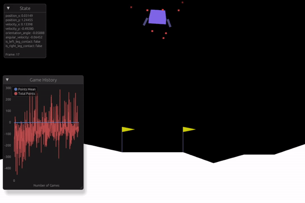

# Lunar Lander v2 using tch-rs
LunarLander-v2 (OpenAI Gym) example, using rust, trc-rs and bevy



#### There are two implementations in this repository:
- [Lunar Lander v2 created by OpenAI Gym](https://github.com/openai/gym/blob/master/gym/envs/box2d/lunar_lander.py), written in rust replacing the original model's python, using the rapier2d physics engine replacing box2d, and bevy, game engine replacing pygame.
- Solution for the lunar lander, based on the solution from [DeepLearning.AI](https://www.deeplearning.ai/) & [Stanford University](https://www.stanford.edu/), using tch-rs (pytorch bindings for rust) replacing tensorflow.

#### Building and running
You need the rust compiler (cargo), then run:
```bashrc
cargo run --release
```

#### Controlling manually
There is an human-controller implementation, for this lunar lander game, to enable it change the human_controller boolean to true in [main.rs](src/main.rs):
```diff
-    let human_controller = false;
+    let human_controller = true;
```
